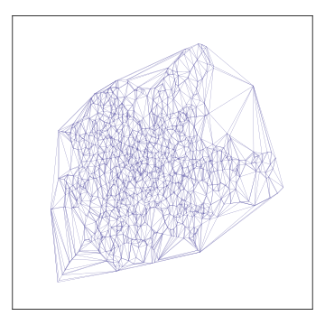
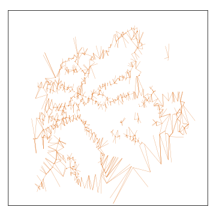

## Method
{:#methodology}

<figure id="triangulation">
  
  
  
  

  <figcaption>
  	Illustration of how two footpath graphs are merged. 
  	The subfigures in counter-clockwise order, starting at the top right:
Noooo 🙂 The written Western world is left to right, top to bottom. But the figures are in the right order, the story is not. Start with the base, then the new services, then missing, then combined.
    (i) the triangulation of an additional regional operator; (ii) an existing triangulation of a larger network; (iii) the edges that are needed to attach the new triangulation to the existing one and (iv) the end result.
You wouldn't have these available in color, would you? Where I can see the missing edges in the new service, and the new service in the combined one? Also, massive bonus points for SVG. Suggestion to remove frame and subcaption from image files; captions should be in the text, frames shouldn't be needed.
  </figcaption>
</figure>

<!-- ### Point Set Triangulation -->

We use a Delaunay triangulation of the public transit stop locations because …. The triangle edges represent footpaths that need to be computed.
rephrase; that doesn't seem accurate. They represent the paths.
A road network route planner is then used to compute the actual path lengths.
okay, so wee need to distinguish between edges of a path and paths themselves; see earlier remark about definition of footpath.
The construction of the triangulation  uses the Euclidean distance between their WGS84 coordinates instead of the walking distance between them because … (maybe just connect to next sentence?). Delaunay triangulations can be generalized to any metric space, but the walking distance is not a mathematical metric because it could, in theory, lack the required symmetry property. Even on foot, you cannot always retrace your steps – either due to legal restrictions or due to physical limitations. And, equally importantly, this would bring us back to the case where an unpractical number of path lengths have to be precomputed. Other metrics such as the _great-circle distance_ can be used, but none of them have any relation to the walking distance so we opted for the most simple metric to implement. This also means that the theoretical guarantees of the Delaunay triangulation only hold for the Euclidean distance. is the consequence drawn here correct? I think the <q>this means</q> part is not right; seems to hold in general. Empirical tests are required to verify that the end result is indeed useful. 
And this is an open question, or you bring that in the next section? Because in the latter case, explicitly say that (and actually, in the former case too).

<!-- ### Merging -->

The paths between stops of a single operator can be calculated independently from the rest. Combining the graphs of two operators is done by comparing their individual triangulations to the triangulation of their combined stops – and computing the missing footpaths. This process is illustrated in Fig. 1 where the graph of a city's public transit network is merged with the one from the region around it. The combined graph is the union of each operators' graph with the additional edges that connect the two graphs. Operators typically have their own service area, which means that the vast majority of paths will be between stops of the same operator, thus making it possible for anyone to combine several operators' graphs with minimal work. The results can be shared and reused, which stands in stark contrast to the conventional approaches. The paths can be published similar to the Routable Tiles dataset so that sharing them does not come at a significant extra cost.
