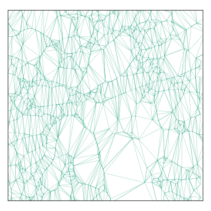

## Methodology
{:#methodology}

<figure id="my-figure">
  
  
  
  

  <strong>Fig. 1:</strong> In counter-clockwise order, starting at the top right: (i) the triangulation of an additional regional operator; (ii) an existing triangulation of a larger network; (iii) the edges that are needed to attach the new triangulation to the existing one and (iv) the end result.
</figure>

We use a Delaunay triangulation of the public transit stop locations to determine which paths to compute, where the triangle edges represent the transit footpaths. A road network route planner is then used to compute the actual path lengths. The triangulation itself is based on the Euclidean distance between points instead of the walking distance for practical reasons, so that we lose the theoretical guarantees of the Delaunay triangulation. Empirical tests are required to verify that the end result is indeed useful. 

The paths between stops of a single operator can be calculated separately from the rest. Combining the graphs of two operators can be done by comparing their individual triangulations to the triangulation of their combined stops – and seeing which edges are missing. This process is illustrated in Fig. 1 where the graph of a single city's public transit is merged with the one from the region around it. The resulting graph is the union of each operators' graph with the additional edges that connect the two graphs. Operators typically have their own service area, which means that the vast majority of paths will be between stops of the same operator. This makes it possible for anyone to combine several operators' graphs, without an impossibly large computational overhead. And just as important: the results can be shared and reused, which stands in stark contrast to the conventional approaches. The paths can be published similar to the Routable Tiles dataset so that sharing them doesn't come at a significant extra cost. 
