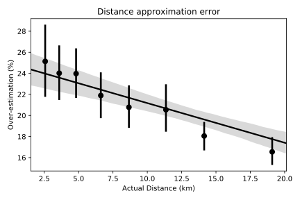

## Results
{:#results}

<figure id="all_errors">
  

    

          
      <strong>2a: </strong> Linear regression plot comparing the actual distances to the approximations. Note that the approximations are strictly overestimations due to the triangle inequality.
    

    

      
      <strong>2b: </strong> Linear regression plot with 8 bins. The mean and standard deviation is shown for each bin, along with the 95% CI in the grey shaded area.
    

    
  

  

      <strong>Fig. 2: </strong> The relative difference between the actual and the approximated distance. Every data point is a path in between railway stations, the distance is approximated using a graph of bus stops and the footpaths between bus stops and railway stations.
  

</figure>

We have made two claims about our method: (i) the graph we construct is almost as good as the complete graph and (ii) footpath graphs can be merged with minimal work. To verify the first claim we have used a graph of paths between bus stops to approximate the distances between railway stations. Edges between train stations and bus stops have also been added to make the railway stations reachable. Fig 2 shows that the approximation overestimates the actual distance by about 20% on average. This seems reasonable for route planners – it is better to underestimate the time needed to catch a connection than to recommend an impossible route.

<table>
  <thead>
    <tr>
      <th>Case</th>
      <th>Paths of first operator</th>
      <th>Paths of second operator</th>
      <th>Additional required paths</th>
    </tr>
  </thead>
  <tbody>
    <tr>
      <td>Flanders + Brussels</td>
      <td>107171</td>
      <td>7969</td>
      <td>2508</td>
    </tr>
    <tr>
      <td>Flanders + Wallonia</td>
      <td>107171</td>
      <td>94730</td>
      <td>4020</td>
    </tr>
  </tbody>
  <caption>
  	<strong>Table 1: </strong> The amount of paths that need to be computed to connect two operators.
  </caption>
</table>

To verify that combining the graphs from two operators does not require too much work we consider both the usual and the worst case scenario, respectively being mostly disjoint service areas and entirely overlapping service areas. We have taken the public transit operators from the Belgian regions of Flanders and Wallonia for the usual case and we revisit the case from Fig. 1 for the worst case, where the Brussels public transit network is added to the one from Flanders. The results in Table 1 show that in the usual scenario merging two operators is relatively straight-forward as most work has already been done. The worst case scenario shows that it is possible that merging two operators can still require a significant amount of work, although the vast majority has already been done. Our implementation contains some additional experiments and is available on [https://github.com/hdelva/planner.js/tree/footpaths](https://github.com/hdelva/planner.js/tree/footpaths) as a frozen branch of an experimental serverless route planner.