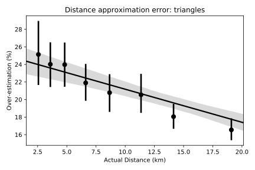

## Results
{:#results}

<figure id="my-figure">
  
  
  <strong>Fig. 2:</strong> Overestimation of actual distances
</figure>

We need to verify two claims: (i) the graph we publish is almost as good as the complete graph and (ii) most paths are between stops of the same operator. To verify the first claim we used a graph of bus stops to approximate the distance between train stations in Belgium. Fig 2 shows that the approximation overestimates the actual distance by about 20% on average. This seems like a reasonable approximation for route planners – it's better to underestimate the time needed to catch a connection than to recommend an impossible route.

<table>
  <thead>
    <tr>
      <th>Case</th>
      <th>Edges of first operator</th>
      <th>Edges of second operator</th>
      <th>Edges between them</th>
    </tr>
  </thead>
  <tbody>
    <tr>
      <td>Flanders + Brussels</td>
      <td>107171</td>
      <td>7969</td>
      <td>2508</td>
    </tr>
    <tr>
      <td>Flanders + Wallonia</td>
      <td>107171</td>
      <td>94730</td>
      <td>4020</td>
    </tr>
  </tbody>
  <caption>
  	<strong>Table 1: </strong> Combining operators
  </caption>
</table>

To verify that combining the graphs from two operators doesn't require too much work we consider both the usual and the worst case scenario, respectively being mostly disjoint service areas and entirely overlapping service areas. We have taken the public transit operators from the Belgian regions of Flanders and Wallonia for the usual case and we revisit the case from Fig. 1 for the worst case, where the Brussels public transit network is added to the one from Flanders. The results in Table 1 show that in the usual scenario merging two operators is relatively straight-forward as most work has already been done. The worst case scenario shows that it is possible that merging two operators can still require a significant amount of work, although the vast majority has still already been done.